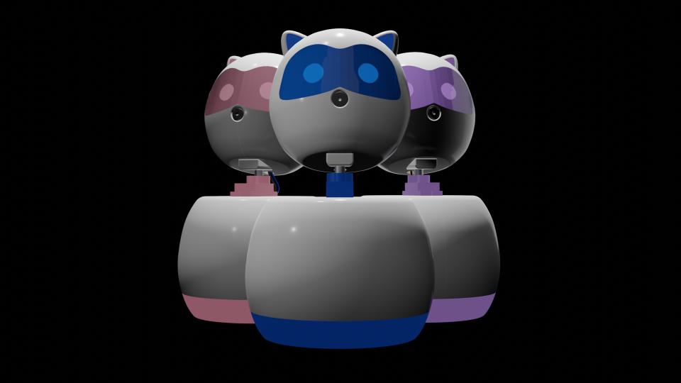

# HRI Project 2022 :robot:

Project for the HRI course module of the university

A simple friendly robot companion to help people who have a tendency to stammer/stutter to improve their speaking skills by having a guided speech with the robot.
The project uses known speech improvement techniques like Breathing exercises, Facial muscle exercises etc.…

## Objectives of the product :star:

- Help reduce stuttering and stammering
- Decrease speech related fears
- Increase self esteem of the user
- Provide a companion to practice speaking skills from the comfort of home

## Features of the product :star:

- Scripted Natural Language based Lessons
- Natural language conversations
- Realtime Face Emotion Detection
- Face tracking for robot head movements
- Friendly interface for the robot

## Technologies used in the product :star:

- Custom Chatbot made using **Whisper API**, **Google STT**(Speech to Text) and **Pyttsx3** TTS(Text to Speech) for the conversational aspect of the robot
- **Deep Face model** for Face emotion detection
- **NodeMCU**, **ESP-32 Cam**, **SG90 Servo motor**, **LEDs** and 3D printed Mold for the outer casing. 


## Build Process :star:

Clone the Git repo:
```
https://github.com/Jayzeen/HRI-Project-2022.git
```
Install The Dependencies
```
pip install -r requirements.txt
```

### Configure Whisper API :star:
1. Navigate to [OpenAI Website](https://openai.com/)
2. Follow on screen instructions to set up an API
3. Retrieve the API key
4. Navigate to project root directory and make a **env** file
5. Add the API key with variable name KEY


Run the project :running_man:
```
python chatbot.py
```